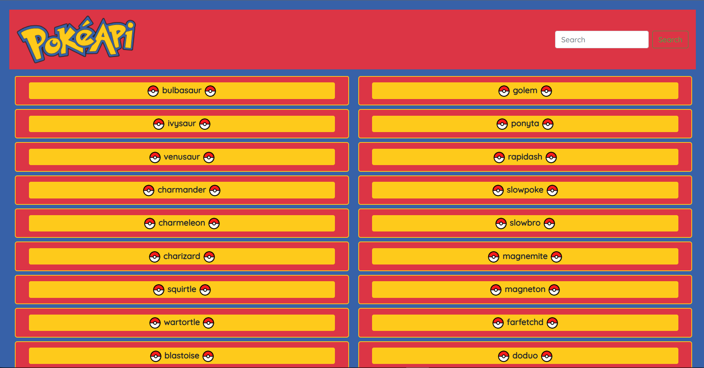
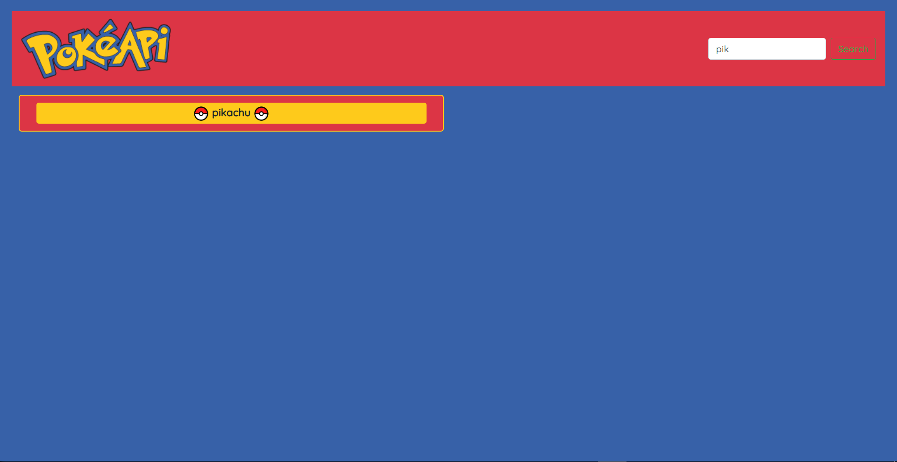
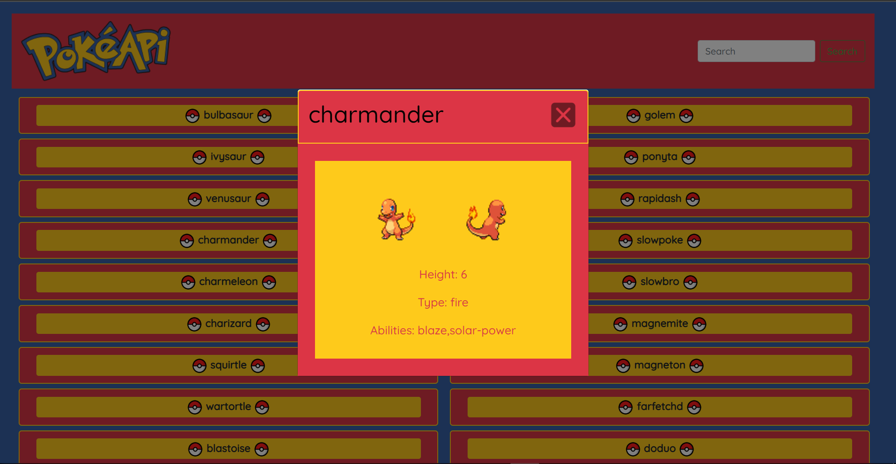

# simple-js-app

## Project Description

This is a small web application with HTML, CSS, and JavaScript that loads data from an external API and enables the viewing of data points in detail.

## User Goals

This application allows users to view a list of data, in this case, the names of different Pokemon.

Users can also view additional details of each Pokemon on demand.

## Project Dependencies

This Project use:

- HTML
- CSS
- JavaScript
- Bootstrap
- ESLint rules

## Resours

- https://pokeapi.co/